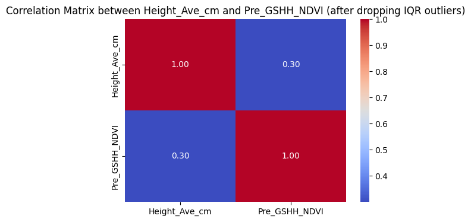
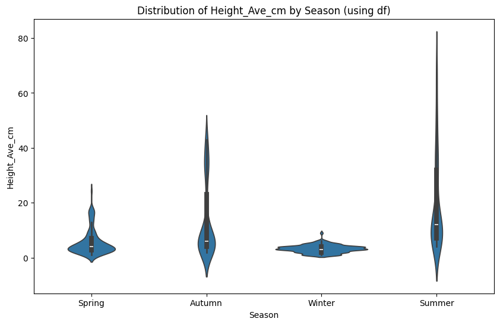

# Dataset Overview

## First 5 Rows

| sample_id | image_path | Sampling_Date | State | Species | Pre_GSHH_NDVI | Height_Ave_cm | target_name | target |
|-----------|------------|---------------|-------|---------|---------------|---------------|-------------|--------|
| ID1011485656__Dry_Clover_g | train\ID1011485656.jpg | 2015/9/4 | Tas | Ryegrass_Clover | 0.62 | 4.6667 | Dry_Clover_g | 0.0000 |
| ID1011485656__Dry_Dead_g | train\ID1011485656.jpg | 2015/9/4 | Tas | Ryegrass_Clover | 0.62 | 4.6667 | Dry_Dead_g | 31.9984 |
| ID1011485656__Dry_Green_g | train\ID1011485656.jpg | 2015/9/4 | Tas | Ryegrass_Clover | 0.62 | 4.6667 | Dry_Green_g | 16.2751 |
| ID1011485656__Dry_Total_g | train\ID1011485656.jpg | 2015/9/4 | Tas | Ryegrass_Clover | 0.62 | 4.6667 | Dry_Total_g | 48.2735 |
| ID1011485656__GDM_g | train\ID1011485656.jpg | 2015/9/4 | Tas | Ryegrass_Clover | 0.62 | 4.6667 | GDM_g | 16.2750 |

## Dataset Dimensions

- **Rows:** 1610
- **Columns:** 9

## Column Names

- sample_id
- image_path
- Sampling_Date
- State
- Species
- Pre_GSHH_NDVI
- Height_Ave_cm
- target_name
- target

## Data Types

| Column | Type |
|--------|------|
| sample_id | string[python] |
| image_path | string[python] |
| Sampling_Date | string[python] |
| State | string[python] |
| Species | string[python] |
| Pre_GSHH_NDVI | float64 |
| Height_Ave_cm | float64 |
| target_name | string[python] |
| target | float64 |

## Missing Values

**No missing values found in any column**

| Column | Missing Values |
|--------|----------------|
| sample_id | 0 |
| image_path | 0 |
| Sampling_Date | 0 |
| State | 0 |
| Species | 0 |
| Pre_GSHH_NDVI | 0 |
| Height_Ave_cm | 0 |
| target_name | 0 |
| target | 0 |

## Categorical Features

### States
- **Number of unique states:** 4
- **Unique values:** Tas, NSW, Vic, WA

### Species
- **Number of unique species:** 15
- **Unique values:**
  - Ryegrass
  - Clover
  - Lucerne
  - Phalaris
  - Fescue
  - WhiteClover
  - BarleyGrass
  - SilverGrass
  - SpearGrass
  - Capeweed
  - CrumbWeed
  - Bromegrass
  - SubcloverLosa
  - SubcloverDalkeith
  - Mixed

## Numerical Features

### Descriptive Statistics

| Statistic | Pre_GSHH_NDVI | Height_Ave_cm |
|-----------|---------------|---------------|
| count | 1610.00 | 1610.00 |
| mean | 0.66 | 7.54 |
| std | 0.15 | 9.95 |
| min | 0.16 | 1.00 |
| 25% | 0.56 | 3.00 |
| 50% (median) | 0.69 | 4.00 |
| 75% | 0.77 | 7.00 |
| max | 0.91 | 70.00 |

### Median Absolute Deviation (MAD)
- **Pre_GSHH_NDVI:** 0.1000
- **Height_Ave_cm:** 1.5000

### Value Ranges
- **Height_Ave_cm:** 1.0 to 70.0
- **Pre_GSHH_NDVI:** 0.16 to 0.91

## Outlier Analysis

### Z-score Outliers (|z| > 3)
- **Pre_GSHH_NDVI:** 0.62%
- **Height_Ave_cm:** 3.11%

### IQR Outliers (outside 1.5×IQR)
- **Pre_GSHH_NDVI:** 0.62%
- **Height_Ave_cm:** 12.42%

### MAD-based Outliers (|deviation| > 3.5×MAD from median)
- **Pre_GSHH_NDVI:** 3.11%
- **Height_Ave_cm:** 18.63%

### Impact of Outlier Removal
- **Original DataFrame shape:** (1610, 9)
- **After removing IQR outliers:** (1400, 9)

#### Correlation Analysis
Correlation between 'Height_Ave_cm' and 'Pre_GSHH_NDVI':
- **Before removing outliers:** ~0.25
- **After removing IQR outliers:** ~0.30
- **Change:** 5% increase, suggesting outliers were influencing the relationship

### Post-Outlier Removal Statistics (Height_Ave_cm)
- **Maximum:** 13.00
- **Minimum:** 1.00
- **Median:** 4.00

## Feature Engineering

### One-Hot Encoded Features

#### Species Encoding (14 features)
- Species_Clover
- Species_Fescue
- Species_Fescue_CrumbWeed
- Species_Mixed
- Species_Phalaris
- Species_Phalaris_BarleyGrass_SilverGrass_SpearGrass_Clover_Capeweed
- Species_Phalaris_Clover
- Species_Phalaris_Clover_Ryegrass_Barleygrass_Bromegrass
- Species_Phalaris_Ryegrass_Clover
- Species_Ryegrass
- Species_Ryegrass_Clover
- Species_SubcloverDalkeith
- Species_SubcloverLosa
- Species_WhiteClover

#### State Encoding (4 features)
- State_NSW
- State_Tas
- State_Vic
- State_WA

#### Season Encoding (4 features)
- Season_Autumn
- Season_Spring
- Season_Summer
- Season_Winter

### Final Feature Set
**Total columns after encoding:** 29

Core features:
- sample_id
- image_path
- Sampling_Date
- Pre_GSHH_NDVI
- Height_Ave_cm
- target_name
- target

Plus 14 species features, 4 state features, and 4 season features.

## Visualizations

### Correlation Matrix (Original Data)

  

The correlation heatmap shows a moderate positive correlation of 0.25 between Height_Ave_cm and Pre_GSHH_NDVI in the original dataset.

### Correlation Matrix (After Outlier Removal)

  

After removing IQR outliers, the correlation between Height_Ave_cm and Pre_GSHH_NDVI increased to 0.30, demonstrating a 5% improvement and indicating that outliers were weakening the relationship between these variables.

### Scatter Plot: Height_Ave_cm vs Pre_GSHH_NDVI

  

This scatter plot visualizes the relationship between vegetation height and NDVI values. There's a moderate positive correlation, with most data points concentrated in the lower height range (1-5cm) across the full NDVI spectrum (0.16-0.91).

### Distribution of Height_Ave_cm by Season

  

This violin plot shows the distribution of average height measurements across different seasons. Summer and Autumn show the widest range of values, with Summer reaching up to 80cm, while Winter shows the most compact distribution around lower values.

### Distribution of Height_Ave_cm by Species

  

The violin plot reveals significant variation in height across different species. Lucerne and Phalaris show the greatest height ranges (up to 80cm), while species like SubcloverLosa and SubcloverDalkeith maintain consistently lower heights below 5cm.
